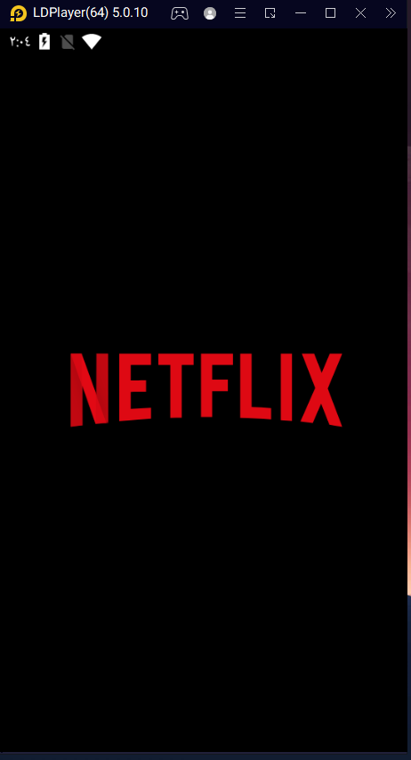

# netflixclone

# Netflix Clone App

The Live Score application is a football sports application that presents the results of today's matches, team formations, and match events. It also allows arrangements for leagues and cups such as the English Premier League and the World Cup.

## Netflix Clone mockup

### Features  

1. **ٍSplash Screens**  

  
2. **Home Feature Screens**  

3. **Details  Feature**  

 

3. **Search Screen**  

 

## Packages Used in the Project  

Below is the list of packages used with their correct links:  

- [http](https://pub.dev/packages/http)
- [carousel_slider](https://pub.dev/packages/carousel_slider)
- [webview_flutter](https://pub.dev/packages/webview_flutter)
- [youtube_player_flutter](https://pub.dev/packages/youtube_player_flutter) 
- [flutter_bloc](https://pub.dev/packages/flutter_bloc) 
- [bloc](https://pub.dev/packages/bloc)
- [equatable](https://pub.dev/packages/equatable) 
- [lottie](https://pub.dev/packages/lottie): 
- [fluttertoast](https://pub.dev/packages/fluttertoast)
---

## Project Highlights  

- **State Management**: Utilizing `Cubit` for predictable and efficient state management.  
- **Clean Code**: Best practices are followed to ensure the app is maintainable and scalable.  
- **MVVM Architecture**: The codebase is structured into Model, View, and ViewModel layers for better organization and future scalability.  

---

